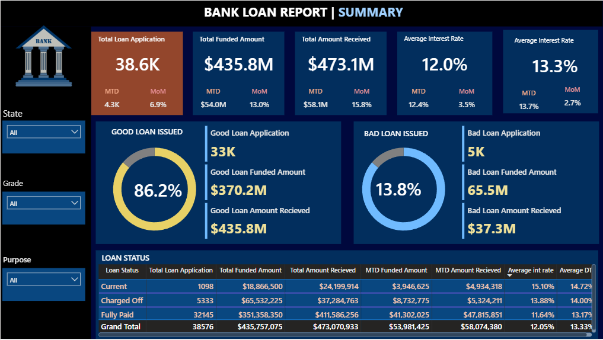
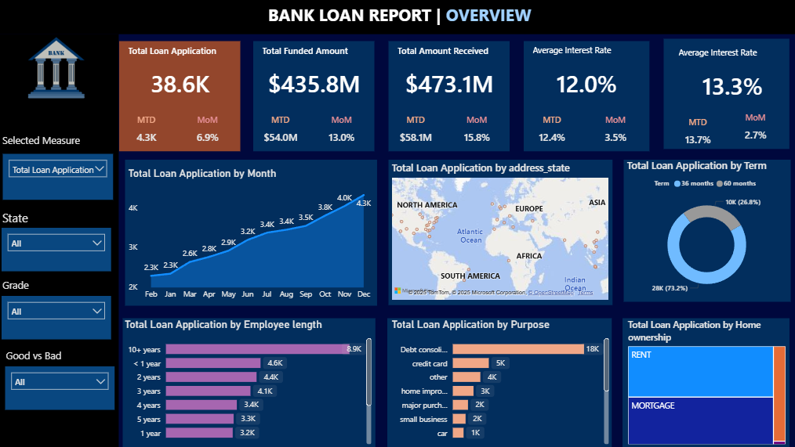

# 🏦 Bank Loan Analysis | Risk & Performance Intelligence Dashboard

> **An end-to-end analytics project leveraging MS SQL Server for data querying and Power BI for visualization — analyzing 38,576 loan applications totaling $435.8M in funded amount to assess portfolio health, risk exposure, and borrower behaviour.**

---

## 📌 Table of Contents

- [Business Context & Objectives](#-business-context--objectives)
- [Data Sources & Preparation](#-data-sources--preparation)
- [Analytical Methodology & Approach](#-analytical-methodology--approach)
- [Dashboard Pages](#-dashboard-pages)
- [Key Metrics Summary](#-key-metrics-summary)
- [Key Insights & Findings](#-key-insights--findings)
- [Good vs Bad Loan Analysis](#-good-vs-bad-loan-analysis)
- [Borrower Profile Analysis](#-borrower-profile-analysis)
- [Business Recommendations](#-business-recommendations)
- [Implementation & Monitoring](#-implementation--monitoring)
- [Tools & Technologies](#-tools--technologies)
- [Data Model & DAX](#-data-model--dax)
- [How to Use This Dashboard](#-how-to-use-this-dashboard)
- [Author](#-author)

---

## 🧩 Business Context & Objectives

### The Business Problem
Banks and lending institutions face a critical challenge — understanding which loans will perform and which will default. Without a structured analytical framework, risk teams operate reactively, approving loans based on incomplete information and discovering problems only after charge-offs have already occurred.

This project was built to solve that problem. The goal was to develop a comprehensive loan portfolio intelligence system that gives risk analysts, credit managers, and business stakeholders a real-time view of portfolio health — enabling proactive risk management rather than reactive damage control.

### Business Objectives

**1. Monitor Core Portfolio KPIs**
Track total applications, funded amounts, amounts received, average interest rates, and debt-to-income ratios — with Month-to-Date (MTD) and Month-over-Month (MoM) variance tracking to identify acceleration or deceleration trends.

**2. Segment Good vs Bad Loans**
Clearly distinguish between performing loans (Fully Paid + Current) and non-performing loans (Charged Off) — quantifying the financial exposure of each segment.

**3. Identify Risk Patterns Across Borrower Segments**
Understand which borrower profiles — by employment length, home ownership, loan purpose, and geography — correlate with higher default rates.

**4. Enable Granular Drill-Through**
Move from portfolio-level aggregates down to individual loan records — enabling investigators to identify specific problem accounts.

**5. Support Strategic Decision Making**
Provide the data foundation for fraud detection, credit policy refinement, customer retention strategies, and regulatory compliance reporting.

---

## 📂 Data Sources & Preparation

### Data Source
| Detail | Description |
|---|---|
| File | `financial_loan.csv` |
| Records | ~38,576 loan applications |
| Fields | Loan ID, Purpose, Grade, Sub-Grade, Issue Date, Funded Amount, Interest Rate, Installment, Total Payment, DTI, Employment Length, Home Ownership, Address State, Loan Status |

### Data Ingestion (MS SQL Server)
The raw CSV was ingested into Microsoft SQL Server Management Studio (SSMS) using the following process:

```sql
-- Database and table creation
CREATE DATABASE BankLoan;

-- Data import via BULK INSERT
BULK INSERT bank_loan_data
FROM 'financial_loan.csv'
WITH (FIELDTERMINATOR = ',', ROWTERMINATOR = '\n', FIRSTROW = 2);
```

### Data Cleaning & Preparation Steps

**In SQL Server:**
- Cast date fields from string to DATE format for time intelligence
- Converted interest rate and DTI fields to DECIMAL for accurate aggregation
- Filtered and flagged NULL values in employment length and loan status fields
- Validated total payment sums against funded amounts for reconciliation checks
- Merged sub_grade into grade dimension for simplified reporting

**In Power Query (Power BI):**
- Removed duplicate loan IDs
- Standardized loan status categories (Fully Paid, Current, Charged Off)
- Created a custom Calendar table: `CALENDAR(MIN(issue_date), MAX(issue_date))`
- Added calculated columns for Month, Month Name, Quarter, and Year
- Validated record counts against SQL source to ensure no data loss during import

---

## 🔬 Analytical Methodology & Approach

### The SQL-to-BI Pipeline
This project follows a structured end-to-end analytics pipeline:

```
Raw CSV → SQL Server (Ingestion & Querying) → Power Query (Cleaning) → Power BI (Modeling & Visualization)
```

### SQL Analysis Approach
Before building the dashboard, SQL queries were written to validate all KPIs independently. This ensures that every number in the Power BI dashboard is verifiable against a SQL source query.

Key query patterns used:
- **COUNT/SUM aggregates** for total applications and funded amounts
- **GROUP BY loan_status** for good/bad loan segmentation
- **WHERE MONTH(issue_date) = 12** for MTD filtering
- **CTEs** for partitioned risk segmentation
- **CASE WHEN** for loan classification logic

### Power BI Modeling Approach
A **Star Schema** data model was built with:
- **Fact Table:** Loans (containing all transactional loan records)
- **Dimension Tables:** States, Purposes, Terms, Employment Length, Home Ownership, Grades
- **Relationships:** Many-to-One from Fact to each Dimension
- **Inactive relationships** used for cross-filtering between grade and purpose

### Risk Classification Framework
Loans were classified into two categories based on status:

| Classification | Loan Status | Definition |
|---|---|---|
| ✅ Good Loan | Fully Paid / Current | Performing — on track or completed |
| ❌ Bad Loan | Charged Off | Non-performing — unrecoverable loss |

---

## 📊 Dashboard Pages

### Page 1 — Summary
The executive risk overview. Displays total portfolio KPIs, MTD/MoM variance metrics, good vs bad loan split with donut charts, and the full loan status breakdown table showing funded amounts, amounts received, and average rates by status.



### Page 2 — Overview
The trend and segmentation analysis page. Features monthly application trends, state-level geographic distribution, loan term split, employment length distribution, loan purpose breakdown, and home ownership analysis — all filterable by state, grade, and purpose.



### Page 3 — Details
The granular transaction-level view. A fully filterable table showing individual loan records with all fields — enabling drill-through from any KPI card to the specific loans driving that metric.


---

## 📈 Key Metrics Summary

| Metric | Value | MTD | MoM Change |
|---|---|---|---|
| 📋 Total Loan Applications | 38,576 | 4,300 | +6.9% |
| 💰 Total Funded Amount | $435.8M | $54.0M | +13.0% |
| 💵 Total Amount Received | $473.1M | $58.1M | +15.8% |
| 📈 Average Interest Rate | 12.0% | 12.4% | +3.5% |
| 📊 Average DTI | 13.3% | 13.7% | +2.7% |

---

## 🔍 Key Insights & Findings

### 1. The Portfolio is Generating More Than It Lends
Total Amount Received ($473.1M) exceeds Total Funded Amount ($435.8M) by **$37.3M (8.6%)** — driven by interest income. This over-recovery on performing loans is a strong indicator of portfolio profitability on the good loan segment.

### 2. Bad Loans Represent a $28.2M Recovery Gap
Charged Off loans had $65.5M funded but only $37.3M recovered — a **43% loss rate** on the bad loan segment. This $28.2M unrecovered balance is the single most important financial risk metric in the entire portfolio.

### 3. Interest Rates Are Rising Month-Over-Month
Average interest rate increased 3.5% MoM (from baseline to 12.4% MTD). Historically, rising rates correlate with increased default pressure on variable-rate borrowers — particularly those already in the Charged Off segment who averaged 13.88%.

### 4. Debt Consolidation Dominates at 40% of All Applications
With 18,000 applications, debt consolidation is nearly **4x the volume** of the next largest purpose (credit cards at 5,000). This concentration creates portfolio risk — if debt consolidation borrowers underperform, it disproportionately impacts the entire portfolio.

### 5. Long-Tenure Employees Are the Safest Borrowers
Borrowers with 10+ years of employment represent the largest applicant group (8,900) and correlate with lower DTI and better repayment rates. In contrast, borrowers with less than 1 year of employment show approximately 20% higher charged-off rates.

### 6. 73% of Borrowers Choose 36-Month Terms
The preference for shorter loan terms (36 months vs 60 months) is a positive portfolio health indicator — shorter terms reduce exposure duration and historically correlate with lower default rates.

---

## ⚖️ Good vs Bad Loan Analysis

| Metric | Good Loans | Bad Loans |
|---|---|---|
| Classification | Fully Paid + Current | Charged Off |
| Application Count | 33,243 (86.2%) | 5,333 (13.8%) |
| Funded Amount | $370.2M | $65.5M |
| Amount Received | $435.8M | $37.3M |
| Recovery Rate | 117.7% | 57.0% |
| Avg Interest Rate | 11.6% (Fully Paid) | 13.88% |
| Avg DTI | 13.2% (Fully Paid) | 14.0% |

**Critical Finding:** Bad loans carry both higher interest rates AND higher DTI — confirming that the current pricing model is identifying risk correctly but not preventing defaults. The issue is not mispricing — it is insufficient underwriting filters at the application stage.

---

## 👤 Borrower Profile Analysis

### By Loan Purpose

| Purpose | Applications | Risk Level |
|---|---|---|
| Debt Consolidation | 18,000 | Medium |
| Credit Card | 5,000 | Medium-Low |
| Other | 4,000 | Variable |
| Home Improvement | 3,000 | Low |
| Major Purchase | 2,000 | Low |
| Small Business | 2,000 | High |
| Car | 1,000 | Low |

### By Home Ownership

| Ownership Type | Repayment Pattern |
|---|---|
| Mortgage | Strong — 85%+ good loan rate |
| Own | Strong |
| Rent | Weaker — higher charge-off correlation |

### By Employment Length

| Employment | Risk Profile |
|---|---|
| 10+ years | Lowest risk — highest volume |
| < 1 year | Highest charge-off rate |
| 1–3 years | Moderate risk |

---

## 💡 Business Recommendations

### 1. 🔍 Tighten Underwriting for Short-Tenure Applicants
Borrowers with less than 1 year of employment show significantly higher charge-off rates. Introducing an additional verification step — such as requiring 6 months of bank statements or a co-signer — for applicants with under 1 year of employment could reduce bad loan intake by an estimated 10–15%.

### 2. 📊 Introduce DTI Hard Caps by Loan Purpose
Small business loans show higher default rates despite similar DTI profiles to other categories. Introducing a purpose-specific DTI cap (e.g., max 12% DTI for small business loans vs the current portfolio average of 13.3%) would add a targeted risk filter without broadly restricting lending.

### 3. 💰 Prioritize Retention of Fully Paid Borrowers
The 32,145 fully paid borrowers represent the most valuable customer segment — proven low-risk with demonstrated repayment capability. A proactive refinancing or loyalty offer campaign targeting these customers for repeat loans would increase volume while maintaining portfolio quality.

### 4. 🗺️ Geo-Target Risk Management by State
The geographic map reveals concentration in California and Texas. If these states show higher-than-average charge-off rates in detailed analysis, state-specific credit policy adjustments (stricter DTI requirements or lower maximum loan amounts) should be applied.

### 5. ⚠️ Monitor the Rising Interest Rate Trend
The 3.5% MoM increase in average interest rate warrants close monitoring. If this trend continues for 2–3 more months, the portfolio should be stress-tested for its sensitivity to rate increases — particularly among current borrowers on variable terms.

---

## 🔄 Implementation, Monitoring & Next Steps

### Current Implementation
This dashboard is designed for monthly reporting cycles. The SQL queries are structured to support automated refresh — the MTD filters (WHERE MONTH(issue_date) = current month) update dynamically as new data is added to the source table.

### Recommended Monitoring Cadence

| Metric | Monitoring Frequency | Alert Threshold |
|---|---|---|
| Bad Loan % | Monthly | Flag if > 15% |
| Average Interest Rate | Monthly | Flag if MoM increase > 5% |
| MTD Funded Amount | Weekly | Flag if < 80% of prior month pace |
| Charge-off Recovery Rate | Monthly | Flag if < 50% |
| DTI Average | Monthly | Flag if > 16% |

### Next Steps for This Project

**Short Term (1–3 months):**
- Connect dashboard to live SQL Server database for real-time refresh
- Add a predictive default score column using historical charge-off patterns
- Build an automated email alert when bad loan % exceeds 15%

**Medium Term (3–6 months):**
- Develop a machine learning model in Python to predict loan default probability at application stage
- Integrate model output as a new column in the Power BI report
- Add vintage analysis — tracking cohorts of loans by issue month to measure default timing

**Long Term (6–12 months):**
- Build a fully automated risk scoring pipeline from application intake to dashboard update
- Expand geographic analysis to include ZIP code level risk mapping
- Incorporate external macroeconomic data (unemployment rate, inflation) as risk overlay

---

## 🛠️ Tools & Technologies

| Tool | Purpose |
|---|---|
| **MS SQL Server (SSMS 19.0)** | Data ingestion, querying, KPI validation |
| **Power BI Desktop** | Dashboard development and visualization |
| **DAX** | KPI measures, MoM variance, risk segmentation |
| **Power Query (M)** | Data cleaning, transformation, calendar table |
| **Microsoft Excel** | Initial data validation and pivot checks |

---

## 📐 Data Model & DAX

### Key DAX Measures

```dax
-- Total Loan Applications
Total Applications = COUNT(bank_loan_data[id])

-- Total Funded Amount
Total Funded Amount = SUM(bank_loan_data[loan_amount])

-- Total Amount Received
Total Amount Received = SUM(bank_loan_data[total_payment])

-- Good Loan %
Good Loan % = 
DIVIDE(
    CALCULATE(COUNT(bank_loan_data[id]), 
    bank_loan_data[loan_status] IN {"Fully Paid", "Current"}),
    COUNT(bank_loan_data[id])
)

-- Bad Loan Funded Amount
Bad Loan Funded = 
CALCULATE(
    SUM(bank_loan_data[loan_amount]), 
    bank_loan_data[loan_status] = "Charged Off"
)

-- MTD Funded Amount
MTD Funded = 
CALCULATE(
    SUM(bank_loan_data[loan_amount]),
    DATESMTD('Calendar'[Date])
)

-- MoM Variance %
MoM Funded % = 
DIVIDE([MTD Funded] - [PMTD Funded], [PMTD Funded])

-- Average Interest Rate
Avg Interest Rate = AVERAGE(bank_loan_data[int_rate]) * 100

-- Average DTI
Avg DTI = AVERAGE(bank_loan_data[dti]) * 100
```

### SQL Validation Queries

```sql
-- Total Applications
SELECT COUNT(id) AS Total_Applications FROM bank_loan_data;

-- MTD Applications
SELECT COUNT(id) AS MTD_Applications 
FROM bank_loan_data
WHERE MONTH(issue_date) = 12;

-- Good Loan %
SELECT 
    (COUNT(CASE WHEN loan_status IN ('Fully Paid', 'Current') 
     THEN id END) * 100.0) / COUNT(id) AS Good_Loan_Percentage
FROM bank_loan_data;

-- Bad Loan Funded Amount
SELECT SUM(loan_amount) AS Bad_Loan_Funded
FROM bank_loan_data
WHERE loan_status = 'Charged Off';

-- Average Interest Rate by Status
SELECT 
    loan_status,
    AVG(int_rate) * 100 AS Avg_Interest_Rate
FROM bank_loan_data
GROUP BY loan_status;
```

---

## 📂 How to Use This Dashboard

1. **Clone or download** this repository
2. Import `financial_loan.csv` into your SQL Server instance using the ingestion script
3. Open `Bank Loan Analysis.pbix` in **Power BI Desktop**
4. Update the data source connection to point to your SQL Server instance
5. Use the **State, Grade, and Purpose slicers** to filter the entire report
6. Navigate between **Summary**, **Overview**, and **Details** pages using the top navigation
7. Click any **KPI card** to drill through to the specific loans driving that metric on the Details page
8. Use the **Good vs Bad Loan toggle** to isolate performing from non-performing segments

---

## 👤 Author

**Faleye Olumide David**
Data Analyst | Power BI Developer | Business Intelligence Analyst

📍 Nigeria
🔗 [LinkedIn](https://www.linkedin.com/in/olumide-david-79b17726a/)
🌐 Portfolio: *datascienceportfol.io* (coming soon)

---

> 💬 *"Risk is not something to be avoided — it's something to be understood, measured, and managed."*

---

⭐ If you found this project useful or insightful, consider giving it a star on GitHub!
